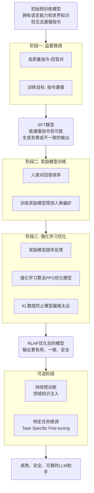

<div align="center">

# ✨ StellarByte ✨

<p>把每个字节都点亮成一盏灯，照见古今同望的夜空。</p>

[](https://www.python.org/)
[](https://pytorch.org/)
[](LICENSE)
[](https://huggingface.co/)
[](https://blog.devnest.top/)

</div>

## 📚 简介

StellarByte 是基于 Transformer 架构的高性能语言模型框架，专为自然语言处理与生成式 AI 任务设计。核心优势包括：

- **工业级性能**：针对训练/推理场景深度优化
- **无缝生态集成**：完全兼容 HuggingFace Transformers，支持即插即用模型迁移
- **研究与应用并重**：既提供前沿算法实现，也保障生产环境部署效率
- **开发者友好**：清晰的模块化设计，支持从实验到部署的全流程

> 适用场景：大模型预训练、参数高效微调(PEFT)、长文本生成任务

## ✨ 特性

### 🚀 性能优化
| 技术 | 收益 |
|------|------|
| FlashAttention 2.0 | 注意力计算速度提升 |
| 动态 KV 缓存 | 内存占用减少 |
| 量化推理支持 | INT8 精度下延迟降低 |

### 🧩 架构创新
- **Dynamic-RoPE 位置编码**：支持 128K 上下文长度，长文本建模能力提升
- **并行残差连接**：梯度传播效率提升，训练收敛速度加快
- **模块化设计**：支持灵活替换 Attention/FFN/Normalization 等核心组件

### ⚙️ 训练优化
- **深度归一化(DeepNorm)**：稳定千亿参数模型训练
- **LayerScale 初始化**：解决 Post-LN 架构梯度消失问题
- **DropPath 正则化**：提升模型泛化能力

### 🤗 生态集成
- 原生支持 HuggingFace 模型库导入/导出
- 兼容 Trainer/Accelerate 等训练工具链
- 提供 LoRA/Adapter 等参数高效微调方案

## 📚 模型结构
> [模型架构](./model_info/model_structure.md)

## 🧠 训练流程

StellarByte支持完整的语言模型训练流程：


## 🔧 安装

### 环境要求

- Python 3.8+
- PyTorch 2.5.1+
- CUDA 10.2+ (GPU加速，可选)

### 安装步骤

```bash
# 克隆仓库
git clone https://github.com/HxCodeWarrior/StellarByte.git
cd StellarByte

# 安装依赖
pip install -r requirements.txt

# 安装开发版本（暂未实现）
# pip install -e .
```

### 依赖说明

项目依赖已按功能模块分类整理：

- **核心依赖**：PyTorch、Transformers、数据处理库
- **模型组件**：位置编码、注意力机制等实现
- **可视化与监控**：实验追踪、指标可视化
- **测试与开发**：单元测试、类型检查
- **分布式训练**：多GPU/多节点训练支持
- **性能优化**：内存优化、计算加速


## 🚀 快速开始

```python
import torch
from model.Model import ByteModel
from model.config import ByteModelConfig

# 创建配置
config = ByteModelConfig(
    vocab_size=32000,
    model_dim=768,
    num_layers=12,
    num_attention_heads=12,
    hidden_dim=3072
)

# 初始化模型
model = ByteModel(config)

# 准备输入
inputs = torch.randint(0, 32000, (1, 512))

# 前向传播
outputs = model(inputs)
```

## 📋 使用示例

### 从 HuggingFace 加载预训练模型(暂未实现)

```python
from model.Model import ByteModel
from transformers import AutoTokenizer

# 加载模型和分词器
model = ByteModel.from_pretrained("path/to/model")
tokenizer = AutoTokenizer.from_pretrained("path/to/tokenizer")

# 编码文本
inputs = tokenizer("把每个字节都点亮成一盏灯", return_tensors="pt")

# 生成文本
outputs = model.generate(inputs.input_ids, max_length=100)
print(tokenizer.decode(outputs[0]))
```

### 使用 MoE 进行混合专家训练(示例)

```python
from model.Model import ByteModel
from model.config import ByteModelConfig

# 配置 MoE
config = ByteModelConfig(
    moe_enabled=True,
    moe_num_experts=8,
    moe_k=2,
    moe_capacity_factor=1.25
)

# 初始化模型
model = ByteModel(config)

# 现在模型将使用 MoE 层替代部分 MLP 层
```

## 📁 项目结构

```
StellarByte/
|   .gitignore
|   CONTRIBUTING.md
|   INSTALL.md
|   LICENSE
|   model_pretrain.py
|   model_rlhf_train.py
|   model_stf_train.py
|   README.md
|   requirements.txt
|   setup.py
|   tokenizer_pretrain.py
|
+---checkpoints
+---configs
|       model_pretrain.yaml
|
+---datasets
|   |   __init__.py
|   |   datasets.py
|   |   sqlmanager.py
|   |
|   +---eval
|   +---test
|   |       test_eval.jsonl
|   |       test_train.jsonl
|   |
|   +---tokenizers
|   |       code.jsonl
|   |       emoji.jsonl
|   |       en.jsonl
|   |       multi_lang.jsonl
|   |       zh.jsonl
|   |
|   +---train
|
+---logs
|
+---model
|   |   Attention.py
|   |   config.py
|   |   DecoderLayer.py
|   |   EmbeddingLayer.py
|   |   MLP.py
|   |   Model.py
|   |   MoE.py
|   |   Position_Embedding.py
|   |   RMSNorm.py
|   |   __init__.py
|   |
|   +---utils
|           DropPath.py
|           KVCache.py
|           LoRA.py
|           __init__.py
|        
|    
+---model_info
|   |   model_report_20250717_030515.md
|   |   model_structure.md
|   |   tokenizer_evaluation_results.json
|   |
|   +---plots
|           compute_distribution.png
|           layer_detailed_structure.png
|           layer_parameters.png
|           model_radar.png
|           parameter_distribution.png
|           sparsity_heatmap.png
|
+---scripts
|       setup_env.bat
|       setup_env.py
|       setup_env.sh
|
+---sources
|   +---corpora
|   |       omw-1.4.zip
|   |       wordnet.zip
|   |
|   +---tokenizers
|
+---test
|       test_Attention.py
|       test_chat.py
|       test_datasets.py
|       test_DeocoderLayer.py
|       test_KVCache.py
|       test_LoRA.py
|       test_MLP.py
|       test_MoELayer.py
|       test_Position_Embedding.py
|       test_RMSNorm.py
|    
|
+---tokenizer
|       special_tokens_map.json
|       tokenizer.json
|       tokenizer_config.json
|
+---utils
        checkpoint.py
        config_params.py
        logger.py
        model_info.py
        progressbar.py

```

## 🤝 贡献指南

欢迎贡献代码、报告问题或提出新功能建议！请遵循以下步骤：

1. Fork 本仓库
2. 创建您的特性分支 (`git checkout -b feature/amazing-feature`)
3. 提交您的更改 (`git commit -m 'Add some amazing feature'`)
4. 推送到分支 (`git push origin feature/amazing-feature`)
5. 打开一个 Pull Request

## 📄 许可证

本项目采用 CC BY-NC 4.0 许可证 - 详情请参阅 [LICENSE](LICENSE) 文件。

## 📖 引用

如果您在研究或项目中使用了本仓库，请按以下方式引用：

```bibtex
@misc{StellarByte,
  author       = {Yao Xiang Zhang},
  title        = {StellarByte},
  year         = {2025},
  publisher    = {GitHub},
  journal      = {GitHub repository},
  howpublished = {\url{https://github.com/HxCodeWarrior/StellarByte}}
}
```

---

## 🌟 致谢

- 感谢所有为 Transformer 架构发展做出贡献的研究者
- 感谢 HuggingFace 团队提供的出色工具和生态系统
- 感谢所有项目贡献者

---

<div align="center">
  <sub>把每个字节都点亮成一盏灯，照见古今同望的夜空。</sub>
</div>