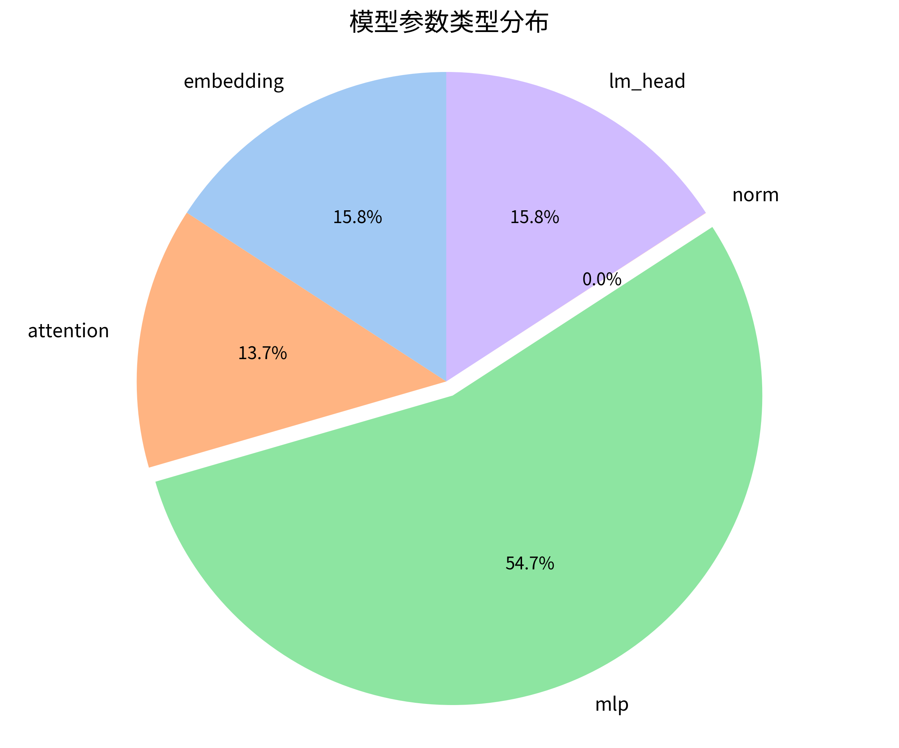
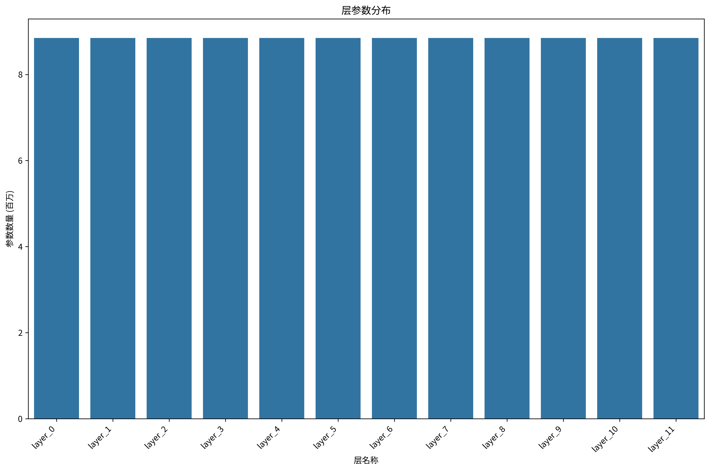

# ByteTransformer 模型分析报告

生成时间: 2025-07-17 03:05:15

## 1. 模型概览

- **模型类型**: ByteTransformer
- **词汇表大小**: 32,000
- **模型维度**: 768
- **层数**: 12
- **注意力头数**: 16
- **KV头数**: 8
- **隐藏层维度**: 3072
- **最大序列长度**: 2048
- **总参数量**: 155,358,240
- **非嵌入参数量**: 106,206,240

## 2. 参数统计

### 2.1 参数类型分布

| 参数类型   |   参数数量 | 占比   |
|:-----------|-----------:|:-------|
| embedding  |   24576000 | 15.82% |
| attention  |   21233664 | 13.67% |
| mlp        |   84934656 | 54.67% |
| norm       |      19200 | 0.01%  |
| lm_head    |   24576000 | 15.82% |

### 2.2 层参数分布

| 层名称   |   参数数量 | 占比   |
|:---------|-----------:|:-------|
| layer_0  |    8850456 | 5.70%  |
| layer_1  |    8850456 | 5.70%  |
| layer_2  |    8850456 | 5.70%  |
| layer_3  |    8850456 | 5.70%  |
| layer_4  |    8850456 | 5.70%  |
| layer_5  |    8850456 | 5.70%  |
| layer_6  |    8850456 | 5.70%  |
| layer_7  |    8850456 | 5.70%  |
| layer_8  |    8850456 | 5.70%  |
| layer_9  |    8850456 | 5.70%  |

*注: 仅显示前10层，共12层*

## 3. 内存使用

| 内存类型   | 大小       |
|:-----------|:-----------|
| 参数       | 592.64 MB  |
| 缓冲区     | 48.00 MB   |
| 激活值     | 316.00 MB  |
| KV缓存     | 36.00 MB   |
| 梯度       | 592.64 MB  |
| 优化器状态 | 1185.29 MB |
| 总计       | 2.71 GB    |

## 4. 计算复杂度

### 4.1 总计算量

- **总浮点运算次数**: 58,485,374,976 FLOPS
- **总浮点运算次数(G)**: 58.49 GFLOPS
- **总浮点运算次数(T)**: 0.0585 TFLOPS

### 4.2 计算分布

| 计算部分   | FLOPS          | 占比   |
|:-----------|:---------------|:-------|
| 注意力层   | 1,409,286,144  | 2.41%  |
| MLP层      | 2,415,919,104  | 4.13%  |
| LM头       | 12,582,912,000 | 21.51% |

### 4.3 生成计算量

- **每个token的浮点运算次数**: 7,471,104 FLOPS
- **每秒浮点运算次数(估计)**: 74,711,040 FLOPS
- **每秒浮点运算次数(G)(估计)**: 0.07 GFLOPS

## 5. 性能分析

设备: cuda

### 5.1 前向传播性能

#### 批次大小 = 1

|   序列长度 | 延迟      | 吞吐量         |
|-----------:|:----------|:---------------|
|        128 | 31.59 ms  | 4,052 tokens/s |
|        512 | 84.01 ms  | 6,094 tokens/s |
|       2048 | 313.93 ms | 6,524 tokens/s |

#### 批次大小 = 4

|   序列长度 | 延迟       | 吞吐量         |
|-----------:|:-----------|:---------------|
|        128 | 65.21 ms   | 7,851 tokens/s |
|        512 | 296.72 ms  | 6,902 tokens/s |
|       2048 | 1143.33 ms | 7,165 tokens/s |

#### 批次大小 = 16

|   序列长度 | 延迟       | 吞吐量         |
|-----------:|:-----------|:---------------|
|        128 | 209.77 ms  | 9,763 tokens/s |
|        512 | 1202.05 ms | 6,815 tokens/s |
|       2048 | 4795.42 ms | 6,833 tokens/s |

### 5.2 生成性能

|   批次大小 | 生成速度       | 每token时间    |
|-----------:|:---------------|:---------------|
|          1 | 28.13 tokens/s | 35.55 ms/token |
|          2 | 34.48 tokens/s | 29.01 ms/token |
|          4 | 39.17 tokens/s | 25.53 ms/token |

## 6. 结论和建议

### 6.1 参数效率

- **嵌入层占比**: 嵌入层参数占总参数的比例为 15.82%
### 6.2 计算效率

- **注意力计算占比**: 注意力计算占总计算量的 2.41%
### 6.3 内存优化

- **KV缓存内存占用**: KV缓存占用 36.00 MB
## 7. 附录：模型架构[简单]

```
ByteTransformer(
  (embed_tokens): Embedding(32000, 768)
  (layers.0): DecoderLayer(
    (self_attn): MultiHeadSelfAttention(
      num_heads=?, dim=768, dropout=?
    )
    (mlp): FeedForward(
      dim_inner=?, activation=gelu
    )
    (norm1): LayerNorm(dim=768)
    (norm2): LayerNorm(dim=768)
  )
  (layers.1): DecoderLayer(
    (self_attn): MultiHeadSelfAttention(
      num_heads=?, dim=768, dropout=?
    )
    (mlp): FeedForward(
      dim_inner=?, activation=gelu
    )
    (norm1): LayerNorm(dim=768)
    (norm2): LayerNorm(dim=768)
  )
  (layers.2): DecoderLayer(
    (self_attn): MultiHeadSelfAttention(
      num_heads=?, dim=768, dropout=?
    )
    (mlp): FeedForward(
      dim_inner=?, activation=gelu
    )
    (norm1): LayerNorm(dim=768)
    (norm2): LayerNorm(dim=768)
  )
  ... (7 层略过) ...
  (final_norm): LayerNorm(768)
  (lm_head): Linear(768, 32000)
)
```

## 8. 可视化图表

### 8.1 参数分布



### 8.2 计算分布


### 8.3 层参数分布



### 8.4 模型层级结构图


### 8.5 参数稀疏度热力图


### 8.7 模型雷达图


